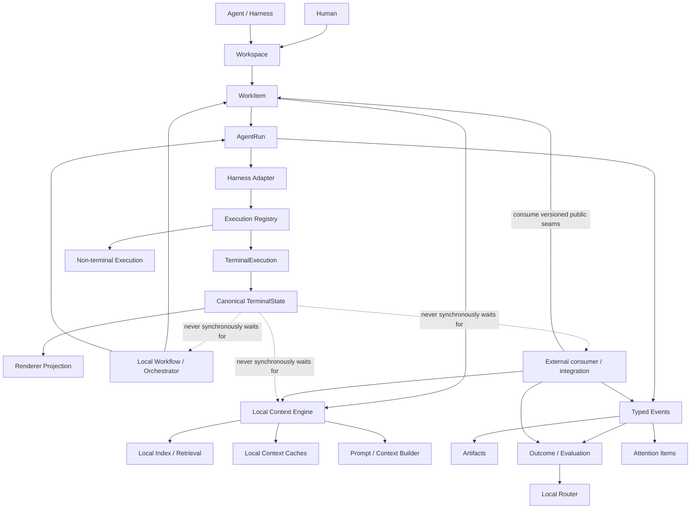
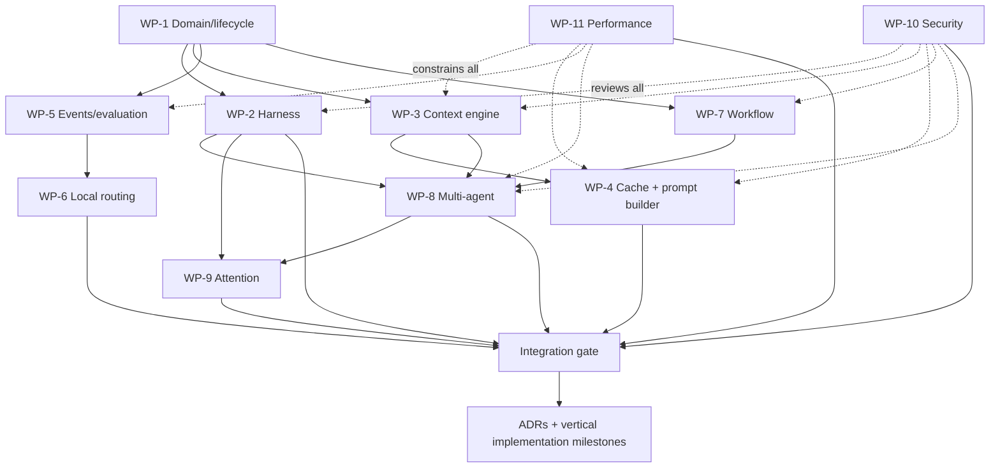

# Seyal Agent Platform Foundation — R&D Plan

**Document:** SEYAL-AGENT-PLATFORM-RD-PLAN-001  
**Status:** Proposed R&D plan  
**Issue:** #48  
**Scope:** OSS agent-native foundation and stable public extension seams. No production implementation is authorized by this document.

## 1. Purpose

Seyal is intended to be an agent-native execution workspace, not a terminal with an AI sidecar. The terminal hot path remains independent:

```text
PTY → VT/parser → TerminalState → damage → renderer
```

Agent, context, cache, evaluation, workflow and orchestration capabilities are additive. They consume stable execution/workspace primitives without owning or synchronously gating terminal infrastructure.

This R&D plan defines the local OSS foundation needed so a developer can use agents, local context, local caching, local workflows and basic multi-agent execution through public, provider-neutral capabilities.

## 2. OSS ownership principle

A capability belongs in this foundation when it:

- is needed for an excellent local agent-native experience;
- works with local or user-configured providers;
- creates a useful ecosystem/interoperability seam;
- improves user trust, portability or debuggability;
- is independently useful without an external hosted service.

Private service/product concerns are outside this document and must not become dependencies of the OSS terminal/runtime foundation.

## 3. Target architecture



## 4. OSS capability map

### 4.1 Execution and harness foundation

The public foundation should provide:

- provider-neutral `AgentId`, `AgentRunId`, `WorkItemId` and `AttemptId` identity;
- versioned harness capability/adapter interfaces;
- local harness adapters where upstream licensing/API terms allow;
- execution capability registry;
- bounded structured run events;
- artifact/diff/result model;
- attention/approval integration.

Unsupported or unknown agents remain ordinary terminal/TUI workloads and must still work correctly.

### 4.2 Local Context Engine

The OSS product should include a real Local Context Engine, not only a schema.

Candidate capabilities:

- project/repository/workspace/user context scopes;
- repository structure and symbol/index metadata;
- relevant documentation and instruction discovery;
- git status/diff/branch/worktree context;
- retained local run discoveries/artifacts where explicitly allowed;
- task-specific retrieval/ranking;
- deterministic context provenance;
- freshness/staleness detection;
- conflict/precedence rules;
- duplicate detection;
- context compaction/summarization through pluggable local or user-configured models;
- token-budget-aware selection;
- sensitivity/privacy metadata;
- user inspection of context selected for external processing.

Source truth must be distinct from derived summaries. Derived material is invalidatable and rebuildable.

### 4.3 Local caching

Candidate cache layers:

| Cache | Purpose | Invalidation key |
|---|---|---|
| content-addressed source cache | avoid rereading unchanged files/artifacts | content hash |
| repository metadata/index cache | avoid rebuilding repository/symbol metadata | revision + file changes |
| embedding/retrieval index cache | avoid repeated semantic indexing | content hash + model/version |
| context selection cache | reuse retrieval results when inputs are unchanged | context fingerprint + task fingerprint |
| summary/compaction cache | avoid repeatedly summarizing identical source material | source hash + summarizer/config |
| prompt/context bundle cache | reuse deterministic assembled bundles | ordered component hashes + policy/config |
| provider prompt-cache metadata | expose cache eligibility/hit accounting | provider/model/session semantics |
| outcome/evaluation cache | reuse deterministic local checks when safe | artifact/worktree/test/config hashes |

Rules:

- cache entries are derived, never authoritative project truth;
- secret/sensitive content needs explicit storage policy;
- caches are bounded and inspectable/clearable;
- cache correctness should use strong revision/hash keys where available;
- unsafe semantic results are not reused merely because text looks similar;
- provider-side prompt caching and Seyal local caching remain separate mechanisms.

### 4.4 Prompt/context builder baseline

The local context/prompt builder should support:

- stable vs task-specific context partitions;
- deterministic ordering/fingerprinting;
- provider capability metadata without provider business logic in domain objects;
- cache-friendly stable prefixes where supported;
- token/context-window budgets;
- progressive context expansion;
- deduplication;
- context provenance manifest;
- local or user-configured model use;
- cached/uncached token accounting when reported.

### 4.5 Evaluation, outcomes and cost accounting

OSS should expose and locally use:

- generic success/failure/cancel outcome model;
- tests/CI/check results when available locally;
- retries/attempts;
- human intervention events;
- elapsed duration;
- provider-reported token/cache/cost data;
- local compute duration/cost hooks;
- acceptance/review hooks;
- local metrics such as cost per successful run and first-attempt success.

### 4.6 Local routing

OSS should support:

- capability-based routing;
- deterministic rule-based routing;
- explicit user routing rules;
- provider/model availability constraints;
- local cost/latency budgets when data is available;
- fallback/escalation chains;
- local routing explanations;
- a versioned router interface for public extensions.

Learned or service-operated routing is outside this OSS plan.

### 4.7 Local workflows and multi-agent execution

The OSS baseline should support:

- local workflow/DAG representation;
- dependencies and parallel nodes;
- start/cancel/retry;
- budget hints;
- local scheduling/queueing;
- handoff of selected context/artifacts;
- basic parallel local agent runs;
- worktree/repository isolation primitives;
- conflict detection hooks;
- human approval nodes;
- attention routing;
- deterministic workflow-state persistence/recovery where practical.

### 4.8 Extension seams

Expose versioned public capability seams for:

- harness adapters;
- context sources/enhancers;
- model/provider adapters;
- retrieval/index providers;
- evaluators;
- routers;
- workflow nodes/triggers that are safe locally;
- artifact processors;
- attention integrations.

Extension APIs must remain coherent public capabilities, never hidden hooks for a private consumer.

## 5. Repository isolation

This document defines only the public OSS foundation. The dependency rule is:

```text
external/private consumer → public Seyal OSS capabilities
Seyal OSS                 ↛ non-OSS/private implementation
```

No outside repository, hosted service, entitlement system, pricing model or private implementation may become required to build, test or use the canonical OSS foundation.

## 6. R&D work packages

### WP-1 — Domain model and lifecycle

Define exact lifecycle/state machines for `WorkItem`, `Agent`, `AgentRun`, `Execution`, `Attempt`, `Artifact`, `Outcome`, `Evaluation`, `Handoff`, and `WorkflowRun`.

Questions include multi-execution runs, multiple agents per work item, durable vs ephemeral identity, GUI/runtime/provider restart semantics, cancellation and recovery.

**Exit:** reviewed state diagrams, invariants and failure semantics.

### WP-2 — Harness capability protocol and adapter study

Research Claude Code, Codex CLI and at least one additional harness. Define provider-neutral capabilities for discover/start/resume/cancel, structured status/events, input/actions, artifacts/diffs, approvals/questions, tools, usage/token/cache/cost metadata, capability discovery, raw TUI compatibility and failure/reconnect behavior.

Avoid lowest-common-denominator design. Optional capabilities are explicit.

**Exit:** capability matrix + protocol sketch + at least two concrete adapter mappings + decision on first OSS adapters.

### WP-3 — Local Context Engine

Define the pipeline:

```text
sources
→ normalize/provenance
→ index
→ retrieve
→ rank
→ freshness/conflict filtering
→ enhance/compact
→ budget
→ context bundle + manifest
```

Research repository/source indexing, local semantic retrieval, deterministic/model-assisted ranking, summarization/compaction, invalidation, precedence/conflicts, sensitivity filtering, explainability and large-repository scaling.

**Exit:** schemas + pipeline + invalidation algorithm + threat model + benchmark/evaluation corpus.

### WP-4 — Local cache architecture and cache-aware prompt builder

Define cache namespaces, keys, bounds, invalidation and security for all cache layers in §4.3.

Provider prompt-cache capabilities are adapter metadata, not core domain authority.

Required measurements include local cache hit rate, index rebuild avoided, summary/compaction reuse, stable-prefix ratio, cached/uncached token accounting where reported, latency/cost avoided and correctness failures.

**Exit:** cache architecture + prompt/context fingerprint spec + invalidation tests + capability matrix.

### WP-5 — Events, outcomes, local evaluation and cost hooks

Define a generic event/evaluation system covering run lifecycle, retries, tests/checks/CI hooks, acceptance/review hooks, human interventions, elapsed time, token/cache usage, cost when reported/derived, compute time and evaluator confidence/provenance.

Create a local evaluation harness for repeatable task fixtures.

**Exit:** event envelope + ordering rules + evaluator contract + fixture format + derived metrics.

### WP-6 — Local routing and escalation

Design a deterministic OSS router:

```text
task + required capabilities + policy + budget + availability
→ candidate harness/model/execution targets
→ explainable rule decision
→ fallback/escalation chain
```

**Exit:** routing interface + rule precedence + worked examples + evaluation method.

### WP-7 — Workflow engine and local scheduler

Research a minimal local workflow engine supporting DAG dependencies, parallelism, retries/cancellation/timeouts, local queues, budget hints, typed inputs/outputs, approval nodes, persistence/recovery, workflow versioning and safe local triggers.

**Exit:** workflow state machine + recovery semantics + three worked workflows.

### WP-8 — Multi-agent coordination, isolation and handoff

Research one-task/many-agent patterns, planner/implementer/tester/reviewer roles, worktree isolation, artifact ownership, context handoff minimization, conflict/duplicate detection, cancellation/replacement and attention escalation.

**Exit:** coordination model + isolation rules + conflict/handoff protocol + failure scenarios.

### WP-9 — Attention and human supervision model

Extend `AttentionItem` for approval, question, conflict, validation failure, security/policy stop, ready-for-review and completion summary.

Define safe supervision of multiple concurrent runs without scraping arbitrary PTY prompts.

**Exit:** typed interaction contracts + prioritization model + supervision metrics.

### WP-10 — Security, privacy and trust

Threat-model malicious/compromised harnesses, prompt/context poisoning, secret leakage, untrusted artifacts, command execution, cross-workspace context exposure, forged events, cache poisoning, unsafe workflow triggers and plugin/provider trust.

**Exit:** trust boundaries + storage classifications + capability/permission checks + deletion/clear semantics.

### WP-11 — Performance and resource isolation

Agent/context/cache/index/evaluation work must stay outside terminal hot paths.

```text
agent/context/cache/index/model/persistence/network delay
                    X
                    │ must never synchronously gate
                    ▼
PTY → VT → TerminalState → damage → render
```

Measure CPU/RSS/disk/index cost separately from terminal latency. Background work must be bounded, cancelable and priority-aware.

**Exit:** latency/resource budgets + benchmark plan + overload/failure behavior.

## 7. Parallel R&D plan



WP-1 establishes shared terminology. Security and performance research start immediately and review every other package. Harness, context, evaluation and workflow R&D can then proceed in parallel. Cache work follows context; routing follows measurable outcomes; multi-agent coordination combines harness/context/workflow primitives.

## 8. Implementation recommendation after R&D

Do not implement all capabilities at once. Recommended vertical order:

```text
terminal/runtime milestone remains authoritative
  ↓
agent/work identities + harness contract
  ↓
one excellent OSS local harness adapter
  ↓
events + local outcome/cost visibility
  ↓
Local Context Engine
  ↓
local caches + cache-aware context builder
  ↓
local evaluation harness
  ↓
local deterministic routing + fallback
  ↓
second harness adapter
  ↓
local workflow engine
  ↓
basic local multi-agent execution + attention
  ↓
extension ecosystem hardening
```

Each vertical milestone must be working, tested, demonstrable and benchmarked where relevant before advancing.

## 9. Explicit completeness checklist

This R&D program is incomplete if any of these areas remain unaddressed:

- [ ] harness abstraction and concrete adapter mappings
- [ ] agent/work/run identity and lifecycle
- [ ] local repository/project context discovery
- [ ] context enhancement/retrieval/ranking
- [ ] context provenance/freshness/invalidation
- [ ] local context compaction/summarization
- [ ] content/index/embedding/retrieval caches
- [ ] summary/compaction cache
- [ ] prompt/context bundle cache
- [ ] provider prompt-cache capability/accounting
- [ ] cache-aware stable prompt/context construction
- [ ] token/context budgeting and progressive expansion
- [ ] local outcome/cost accounting
- [ ] local evaluation harness and task fixtures
- [ ] explainable rule/capability routing
- [ ] fallback/escalation routing
- [ ] local workflows/DAGs
- [ ] local scheduling/queues
- [ ] basic parallel multi-agent execution
- [ ] worktree/repository isolation
- [ ] context/artifact handoffs
- [ ] duplicate-work/conflict detection
- [ ] attention/approvals/human supervision
- [ ] failure/retry/cancel/recovery semantics
- [ ] security/privacy/secret handling
- [ ] cache/context poisoning defenses
- [ ] plugin/extension seams
- [ ] performance/resource isolation
- [ ] no reverse dependency on non-OSS/private implementation

## 10. Decisions intentionally deferred

Do not prematurely choose:

- exact provider SDK implementation;
- vector database/storage engine;
- embedding model;
- learned routing algorithm;
- external synchronization technology;
- distributed scheduler technology.

These need evidence from R&D and are outside this plan until an OSS requirement justifies them.

## 11. R&D completion gate

This phase completes only when:

1. identities/lifecycles are unambiguous;
2. at least two harnesses map cleanly to the capability protocol;
3. a concrete local context pipeline including enhancement and invalidation is specified;
4. all local cache layers and correctness/security rules are specified;
5. prompt/context building and provider cache metadata are modeled without provider lock-in;
6. outcomes/costs/evaluations are locally representable without mandatory telemetry;
7. deterministic local routing can be explained and evaluated;
8. local workflows and basic multi-agent execution are representable;
9. isolation/handoff/conflict semantics are defined;
10. security and terminal hot-path isolation are proven architecturally;
11. OSS remains independently useful with no non-OSS/private dependency;
12. implementation can be split into vertical milestones with measurable exit criteria.
