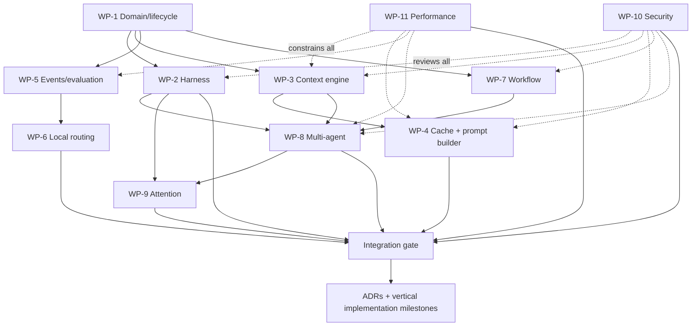

# Seyal Agent Platform Foundation — R&D Plan

**Document:** SEYAL-AGENT-PLATFORM-RD-PLAN-001  
**Status:** Proposed R&D plan  
**Issue:** #48  
**Scope:** OSS agent-native foundation and stable extension seams. No production implementation is authorized by this document.

## 1. Purpose

Seyal is intended to be an agent-native execution workspace, not a terminal with an AI sidecar. The terminal hot path remains independent:

```text
PTY → VT/parser → TerminalState → damage → renderer
```

Agent, context, cache, evaluation, workflow and orchestration capabilities are additive. They consume stable execution/workspace primitives without owning or synchronously gating terminal infrastructure.

This R&D plan defines the **strong local OSS foundation** needed so a developer can use agents, local context, local caching, local workflows and basic multi-agent execution without a paid service. Commercial products may consume these public seams for managed team/org context, hosted execution, proprietary optimization and organization-scale operations, but Seyal OSS must not depend on commercial code.

## 2. Ownership principle

The split is explicitly **not**:

```text
terminal = OSS
AI = commercial
```

The default split is:

```text
portable + local + generic + independently useful = OSS

managed multi-user service + hosted infrastructure + organization-scale state
+ proprietary learned optimization + enterprise operations = external/commercial consumer
```

A capability should default to OSS when it:

- is needed for an excellent local agent-native experience;
- can work with local/BYOK providers without Seyal-operated infrastructure;
- creates an ecosystem/interoperability seam;
- improves user trust, portability or debuggability;
- would make the OSS product feel artificially crippled if withheld.

A capability may live outside OSS when its value materially depends on hosted infrastructure, organization-wide state, proprietary learned intelligence, centralized operations or paid service delivery.

## 3. Target architecture


## 4. OSS capability map

### 4.1 Execution and harness foundation

| Capability | OSS recommendation | Notes |
|---|---|---|
| `AgentId`, `AgentRunId`, `WorkItemId`, `AttemptId` | Yes | stable provider-neutral identity |
| harness capability/adapter interface | Yes | no vendor lock-in |
| basic first-party local harness adapters | Yes, subject to upstream licensing/API terms | Claude Code/Codex-class tools should work without paid Seyal code |
| execution capability registry | Yes | local/remote capability description, not proprietary ranking |
| structured run events | Yes | bounded/asynchronous relative to terminal I/O |
| artifact/diff/result model | Yes | local files/results require no cloud |
| attention/approval integration | Yes | core agent-native local UX |

### 4.2 Local context and context enhancement

The OSS product should include a real **Local Context Engine**, not only a schema.

Recommended local capabilities:

- project/repository/workspace/user context scopes;
- repository structure and symbol/index metadata;
- relevant documentation and instruction discovery;
- git status/diff/branch/worktree context;
- prior local run discoveries and artifacts when explicitly retained;
- task-specific retrieval/ranking;
- deterministic context provenance;
- freshness/staleness detection;
- conflict/precedence rules;
- duplicate detection;
- context compaction/summarization through pluggable local/BYOK models;
- token-budget-aware selection;
- explicit sensitivity/privacy metadata;
- user inspection of exactly what context will be sent.

The context engine must distinguish **source truth** from derived summaries. Derived material is invalidatable and rebuildable.

### 4.3 Local caching

Local caching is an OSS performance/cost capability. It must be explicitly designed rather than hidden inside adapters.

Candidate cache layers:

| Cache | Purpose | Invalidation key |
|---|---|---|
| content-addressed source cache | avoid rereading unchanged files/artifacts | content hash |
| repository metadata/index cache | avoid rebuilding repo/symbol metadata | repo revision + file changes |
| embedding/retrieval index cache | avoid repeated semantic indexing | content hash + embedding model/version |
| context selection cache | reuse retrieval results when task/context inputs are unchanged | context fingerprint + task fingerprint |
| summary/compaction cache | avoid repeatedly summarizing identical source material | source hash + summarizer/model/config |
| prompt/context bundle cache | reuse deterministic assembled bundles | ordered component hashes + policy/config |
| provider prompt-cache metadata | expose provider cache eligibility/hit accounting | provider/model/session semantics |
| outcome/evaluation cache | reuse deterministic local checks when inputs are identical and safe | artifact/worktree/test/config hashes |

Rules:

- cache entries are derived, never authoritative project truth;
- secret/sensitive content needs explicit storage policy;
- caches must be bounded and inspectable/clearable;
- cache correctness must never rely on wall-clock freshness alone when stronger revision/hash keys exist;
- unsafe semantic results must not be reused merely because text looks similar;
- provider-side prompt caching and Seyal local caching are separate mechanisms.

### 4.4 Prompt/context builder baseline

A local OSS context/prompt builder should support:

- stable vs task-specific context partitions;
- deterministic ordering/fingerprinting;
- provider capability metadata without embedding provider business logic into domain objects;
- cache-friendly stable prefixes where the provider supports them;
- token/context-window budgets;
- progressive context expansion;
- deduplication;
- context provenance manifest;
- local/BYOK model use;
- cached/uncached token accounting when the provider reports it.

Advanced learned optimization across teams/providers can remain outside OSS; the baseline mechanism should not.

### 4.5 Evaluation, outcomes and cost accounting

OSS should expose and locally use:

- generic success/failure/cancel outcome model;
- tests/CI/check results when available locally;
- retries/attempts;
- human intervention events;
- elapsed duration;
- provider-reported token/cache/cost data;
- local compute duration/cost hooks;
- acceptance/review hooks;
- local metrics such as cost per successful run and first-attempt success.

Organization aggregation/benchmarking is not required for the local foundation.

### 4.6 Local routing

Routing should not be entirely paywalled.

OSS should support:

- capability-based routing;
- deterministic rule-based routing;
- explicit user routing rules;
- provider/model availability constraints;
- rough local cost/latency budgets when data is available;
- fallback/escalation chains;
- routing decision explanation/audit locally;
- a versioned router interface for plugins/managed consumers.

A proprietary learned router trained/tuned on organization-scale outcomes is a separate higher-level capability.

### 4.7 Local workflows and multi-agent execution

Because Seyal is agent-native, OSS should support a useful local baseline:

- local workflow/DAG representation;
- dependencies and parallel nodes;
- start/cancel/retry;
- budget hints;
- local scheduling/queueing;
- handoff of selected context/artifacts;
- basic parallel local agent runs;
- worktree/repository isolation primitives;
- conflict detection hooks;
- human approval nodes;
- attention routing;
- deterministic workflow state persistence/recovery where practical.

Organization-wide fleet scheduling, hosted workers, team permissions and managed reliability remain separate services.

### 4.8 Extension seams

OSS should expose versioned capability seams for:

- harness adapters;
- context sources/enhancers;
- model/provider adapters;
- retrieval/index providers;
- evaluators;
- routers;
- workflow nodes/triggers that are safe locally;
- artifact processors;
- attention integrations.

## 5. External/commercial boundary contract

This OSS document does **not** define a commercial product roadmap. It defines only what OSS must make possible without reverse dependency.

Examples of capabilities that may be built by external/commercial consumers of OSS seams include:

- managed multi-user synchronization;
- organization-wide shared state;
- hosted/background execution;
- proprietary learned optimization;
- centrally operated fleet scheduling;
- enterprise identity/policy/administration;
- billing/support/SLA services.

The detailed product packaging, monetization and commercial feature roadmap belong in `seyal-commercial`, not this repository.

## 6. R&D work packages

### WP-1 — Domain model and lifecycle

Define exact lifecycle/state machines for:

- `WorkItem`
- `Agent`
- `AgentRun`
- `Execution`
- `Attempt`
- `Artifact`
- `Outcome`
- `Evaluation`
- `Handoff`
- `WorkflowRun`

Questions include multi-execution runs, multiple agents per work item, durable vs ephemeral identity, GUI/runtime/provider restart semantics, cancellation and recovery.

**Exit:** reviewed state diagrams, invariants and failure semantics.

### WP-2 — Harness capability protocol and adapter study

Research Claude Code, Codex CLI and at least one additional harness. Define provider-neutral capabilities for:

- discover/start/resume/cancel;
- structured status/events;
- input/actions;
- artifacts/diffs;
- approvals/questions;
- tools;
- usage/token/cache/cost metadata;
- capability discovery;
- raw TUI compatibility;
- failure/reconnect behavior.

Avoid lowest-common-denominator design. Optional capabilities are explicit.

**Exit:** capability matrix + protocol sketch + at least two concrete adapter mappings + decision on first OSS adapters.

### WP-3 — Local Context Engine

Define the complete local context pipeline:

```text
sources
→ normalize/provenance
→ index
→ retrieve
→ rank
→ freshness/conflict filtering
→ enhance/compact
→ budget
→ context bundle + manifest
```

Research:

- repository/source indexing;
- local semantic retrieval;
- deterministic and model-assisted ranking;
- local/BYOK summarization/compaction;
- freshness/invalidation cascade;
- context precedence/conflicts;
- sensitivity filtering;
- explainability: why each context item was selected;
- large repository scaling.

**Exit:** schemas + pipeline + invalidation algorithm + threat model + benchmark/evaluation corpus.

### WP-4 — Local cache architecture and cache-aware prompt builder

Define cache namespaces, keys, bounds, invalidation and security for all cache layers listed in §4.3.

Research provider prompt-cache capabilities as adapter metadata, but keep provider-specific behavior out of core domain models.

Required metrics:

- local cache hit rate;
- index rebuild avoided;
- summary/compaction reuse;
- prompt stable-prefix ratio;
- cached vs uncached tokens where reported;
- tokens/latency/cost avoided;
- cache correctness failures.

**Exit:** cache architecture, prompt/context fingerprint specification, cache invalidation tests and provider capability matrix.

### WP-5 — Events, outcomes, local evaluation and cost hooks

Define a generic event/evaluation system including:

- run lifecycle;
- retries;
- tests/checks/CI hooks;
- acceptance/review hooks;
- human interventions;
- elapsed time;
- tokens/cache usage;
- monetary cost when reported/derived;
- compute time;
- evaluator confidence/provenance.

Create a local evaluation harness that can compare harness/model/config choices on repeatable task fixtures.

**Exit:** event envelope + ordering rules + evaluator contract + baseline task fixture format + derived metric definitions.

### WP-6 — Local routing and escalation

Design a deterministic OSS router before any learned router:

```text
task + required capabilities + policy + budget + availability
→ candidate harness/model/execution targets
→ explainable score/rule decision
→ fallback/escalation chain
```

Research cost/latency/success inputs without requiring hosted intelligence.

**Exit:** routing interface + rule precedence + worked examples + evaluation method.

### WP-7 — Workflow engine and local scheduler

Research a minimal local workflow engine supporting:

- DAG dependencies;
- parallelism;
- retries/cancellation/timeouts;
- local queues;
- budget hints;
- typed inputs/outputs;
- approval nodes;
- persistence/recovery;
- workflow versioning;
- safe local triggers.

**Exit:** workflow state machine + recovery semantics + three worked workflows.

### WP-8 — Multi-agent coordination, isolation and handoff

Research:

- one task → many agents;
- planner/implementer/tester/reviewer patterns;
- worktree/repository isolation;
- artifact ownership;
- context handoff minimization;
- conflict detection/reconciliation;
- duplicate-work detection;
- agent cancellation/replacement;
- shared vs private context boundaries;
- attention escalation.

**Exit:** coordination model + isolation rules + conflict/handoff protocol + failure scenarios.

### WP-9 — Attention and human supervision model

Extend the existing `AttentionItem` foundation for agent work:

- approval;
- question;
- conflict;
- validation failure;
- security/policy stop;
- ready-for-review;
- completion summary.

Define how one user safely supervises multiple concurrent runs without scraping arbitrary PTY prompts.

**Exit:** typed interaction contracts + prioritization model + supervision metrics.

### WP-10 — Security, privacy and trust

Threat-model:

- malicious/compromised harnesses;
- prompt/context poisoning;
- secret leakage into context/cache/prompts;
- untrusted artifacts;
- arbitrary command execution;
- cross-workspace context exposure;
- forged outcome/evaluation events;
- cache poisoning;
- unsafe workflow triggers;
- plugin/provider trust.

**Exit:** trust boundaries + storage classifications + capability/permission checks + deletion/clear semantics.

### WP-11 — Performance and resource isolation

Agent/context/cache/index/evaluation work must stay outside terminal hot paths.

```text
agent/context/cache/index/model/persistence/network delay
                    X
                    │ must never synchronously gate
                    ▼
PTY → VT → TerminalState → damage → render
```

Measure CPU/RSS/disk/index cost separately from terminal latency. Background context/index work must be bounded, cancelable and priority-aware.

**Exit:** latency/resource budgets + benchmark plan + overload/failure behavior.

## 7. Parallel R&D plan



WP-1 establishes shared terminology. Security and performance research start immediately and review every other package. Harness, context, evaluation and workflow R&D can then proceed in parallel. Cache work follows the context model; routing follows measurable outcomes; multi-agent coordination combines harness/context/workflow primitives.

## 8. Implementation recommendation after R&D

Do not implement all capabilities at once. Recommended vertical order:

```text
terminal/runtime milestone remains authoritative
  ↓
agent/work identities + harness contract
  ↓
one excellent OSS local harness adapter
  ↓
events + local outcome/cost visibility
  ↓
Local Context Engine
  ↓
local caches + cache-aware context builder
  ↓
local evaluation harness
  ↓
local deterministic routing + fallback
  ↓
second harness adapter
  ↓
local workflow engine
  ↓
basic local multi-agent execution + attention
  ↓
extension ecosystem hardening
```

Each vertical milestone must be working, tested, demonstrable and benchmarked where relevant before advancing.

## 9. Explicit completeness checklist

This R&D program is incomplete if any of these areas remain unaddressed:

- [ ] harness abstraction and concrete adapter mappings
- [ ] agent/work/run identity and lifecycle
- [ ] local repository/project context discovery
- [ ] context enhancement/retrieval/ranking
- [ ] context provenance/freshness/invalidation
- [ ] local context compaction/summarization
- [ ] content/index/embedding/retrieval caches
- [ ] summary/compaction cache
- [ ] prompt/context bundle cache
- [ ] provider prompt-cache capability/accounting
- [ ] cache-aware stable prompt/context construction
- [ ] token/context budgeting and progressive expansion
- [ ] local outcome/cost accounting
- [ ] local evaluation harness and task fixtures
- [ ] explainable rule/capability routing
- [ ] fallback/escalation routing
- [ ] local workflows/DAGs
- [ ] local scheduling/queues
- [ ] basic parallel multi-agent execution
- [ ] worktree/repository isolation
- [ ] context/artifact handoffs
- [ ] duplicate-work/conflict detection
- [ ] attention/approvals/human supervision
- [ ] failure/retry/cancel/recovery semantics
- [ ] security/privacy/secret handling
- [ ] cache/context poisoning defenses
- [ ] plugin/extension seams
- [ ] performance/resource isolation
- [ ] no reverse dependency on commercial code

## 10. Decisions intentionally deferred

Do not prematurely choose:

- exact provider SDK implementation;
- vector database/storage engine;
- embedding model;
- proprietary/learned routing algorithm;
- hosted synchronization technology;
- distributed fleet scheduler;
- enterprise policy language;
- billing metric.

These need evidence from R&D and, where commercial, revenue validation.

## 11. R&D completion gate

This phase completes only when:

1. identities/lifecycles are unambiguous;
2. at least two harnesses map cleanly to the capability protocol;
3. a concrete local context pipeline including enhancement and invalidation is specified;
4. all local cache layers and correctness/security rules are specified;
5. prompt/context building and provider cache metadata are modeled without provider lock-in;
6. outcomes/costs/evaluations are locally representable without mandatory telemetry;
7. deterministic local routing can be explained and evaluated;
8. local workflows and basic multi-agent execution are representable;
9. isolation/handoff/conflict semantics are defined;
10. security and terminal hot-path isolation are proven architecturally;
11. OSS remains independently useful with no commercial dependency;
12. implementation can be split into vertical milestones with measurable exit criteria.
