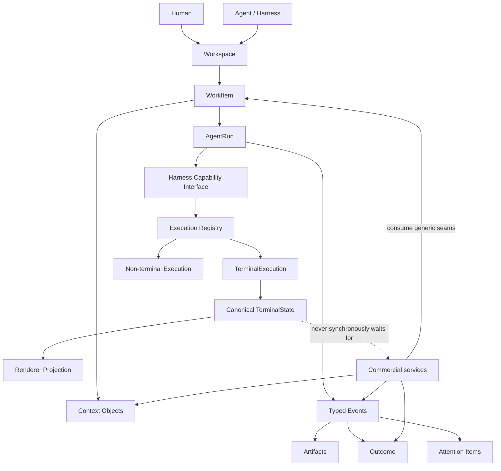
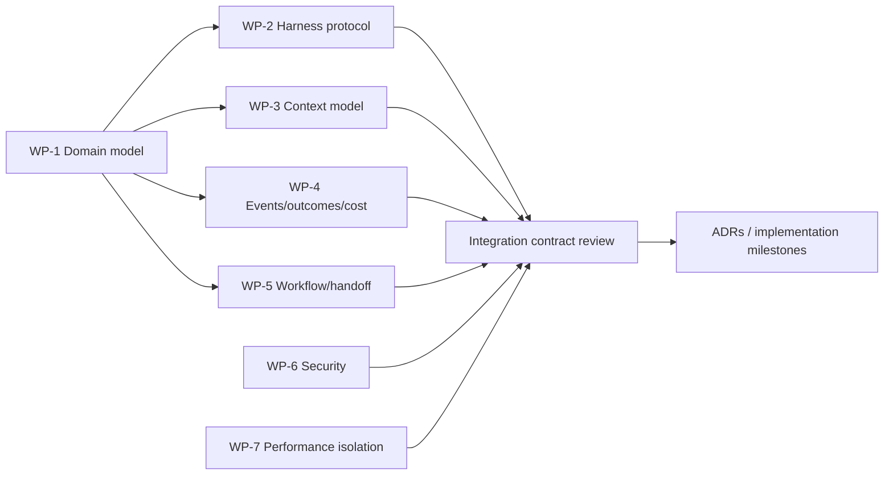

# Seyal Agent Platform Foundation — R&D Plan

**Document:** SEYAL-AGENT-PLATFORM-RD-PLAN-001  
**Status:** Proposed R&D plan  
**Issue:** #48  
**Scope:** OSS foundation and commercial seams only; no production agent implementation is authorized by this document.

## 1. Purpose

Seyal is intended to be an agent-native execution workspace, not a terminal with an AI sidecar. The terminal hot path remains independent:

```text
PTY → VT/parser → TerminalState → damage → renderer
```

Agent capabilities are additive and consume stable execution/workspace primitives without owning terminal infrastructure.

This R&D plan defines the generic OSS foundations needed so that local agents, external harnesses, workflows, context, artifacts and outcomes can interoperate cleanly while allowing `seyal-commercial` to add managed routing, team context, cloud execution, proprietary orchestration intelligence and enterprise services without duplicating the terminal engine.

## 2. Boundary principle

The split is not:

```text
terminal = OSS
AI = commercial
```

It is:

```text
portable/local/generic execution primitives = OSS
managed service + org-scale intelligence + hosted operations = commercial
```

A capability should remain OSS when it is required for a strong local developer experience, is broadly reusable without Seyal-operated infrastructure, and forms a stable extension seam. A capability should be commercial when its value depends materially on hosted services, organization-wide state, proprietary optimization, centralized administration, paid infrastructure or differentiated managed operations.

## 3. Target architecture



## 4. Candidate OSS primitives

The following should be researched as OSS-first unless evidence shows otherwise.

| Primitive | Why OSS | Important constraint |
|---|---|---|
| `AgentId`, `AgentRunId`, `WorkItemId` | stable local identity and interoperability | no provider-specific business logic |
| `HarnessAdapter` capability contract | permits Claude Code, Codex and future harnesses without coupling | capabilities/events, not terminal scraping when structured APIs exist |
| execution capability registry | generic routing target description | no proprietary ranking algorithm |
| typed agent/run events | enables UI, persistence, plugins and local automation | bounded/asynchronous relative to terminal I/O |
| artifact model | generic diffs/files/results produced by executions | no commercial storage requirement |
| outcome model | generic success/failure/test/review result representation | commercial scoring may extend it |
| cost-event schema | local accounting hooks for tokens/compute/time where available | collection must be optional and privacy-safe |
| attention/approval integration | local multi-agent usability | no arbitrary PTY prompt scraping |
| local context object model | project/user-local reusable context, provenance and freshness | no hosted team-memory dependency |
| workflow/run primitives | local reusable automation and DAG representation | managed scheduling/service stays commercial |
| handoff primitive | generic transfer of task/context/artifacts between agents | provider-neutral |
| extension/plugin seams | allows ecosystem growth | versioned, capability-based |

## 5. Likely commercial ownership

The OSS foundation must expose clean seams for these without implementing their managed behavior.

| Capability | Commercial rationale |
|---|---|
| organization/team shared context service | centralized multi-user state, permissions, synchronization |
| proprietary context ranking/compiler service | differentiated optimization and managed model/provider knowledge |
| provider-aware cache optimization service | ongoing provider-specific tuning and economics |
| smart routing engine | proprietary outcome/cost optimization across models/harnesses/compute |
| managed multi-agent scheduler | fleet scheduling, quotas, reliability and organization policies |
| hosted/background/cloud execution | direct infrastructure cost and operations |
| team workflow service | shared workflows, triggers, synchronization, permissions |
| outcome/cost intelligence dashboard | organization aggregation, benchmarking and financial reporting |
| enterprise identity/policy/audit | deployment/governance layer |
| billing/entitlements/support/SLA | commercial operations |

## 6. R&D work packages

### WP-1 — Domain model and lifecycle

Define exact lifecycle/state machines for:

- `WorkItem`
- `Agent`
- `AgentRun`
- `Execution`
- `Attempt`
- `Artifact`
- `Outcome`
- `Handoff`

Questions:

- Can one `AgentRun` span multiple executions?
- Can multiple agents observe or contribute to one work item?
- What survives GUI close, runtime restart, or provider restart?
- Which identities are durable vs ephemeral?

**Exit:** reviewed state diagrams, invariants and failure semantics.

### WP-2 — Harness capability protocol

Research Claude Code, Codex CLI and at least one additional harness. Define a provider-neutral capability model for:

- start/resume/cancel
- input/action requests
- structured status/events
- artifacts/diffs
- approvals/questions
- tool use
- usage/cost metadata
- capability discovery

Avoid lowest-common-denominator design; adapters may expose optional capabilities.

**Exit:** protocol sketch + capability matrix + two concrete mapping examples.

### WP-3 — Local context model

Define a reusable OSS context object with:

- scope: user/project/repository/workspace/run
- provenance/source
- version
- freshness/invalidation
- sensitivity classification
- permissions hints
- content reference vs inline payload
- deterministic identity/hash where useful

Do not design hosted team memory here.

**Exit:** schema, lifecycle, invalidation examples and privacy threat review.

### WP-4 — Events, outcomes and cost hooks

Define generic typed events required to measure execution quality without turning telemetry into a terminal dependency.

Candidate dimensions:

- started/completed/failed/cancelled
- retry/attempt
- test/CI result
- review/acceptance result
- human intervention
- elapsed duration
- provider-reported token/cost data
- compute duration

**Exit:** event envelope, ordering rules, bounded delivery behavior and sample derived metrics.

### WP-5 — Workflow and handoff primitives

Research a minimal local DAG/workflow model supporting:

- dependencies
- parallel nodes
- retries
- cancellation
- budget hints
- handoff of selected context/artifacts
- human approval nodes

Do not implement a distributed scheduler.

**Exit:** local workflow state model and failure/recovery examples.

### WP-6 — Security and trust model

Threat-model:

- malicious/compromised harnesses
- prompt/context poisoning
- secret leakage
- untrusted artifacts
- arbitrary command execution
- cross-workspace data exposure
- forged completion/outcome events

**Exit:** trust boundaries and mandatory capability/permission checks.

### WP-7 — Performance isolation

Prove agent/event/context work remains outside terminal hot paths.

Required architecture rule:

```text
agent/context/persistence/network delay
        X
        │ must never synchronously gate
        ▼
PTY → VT → TerminalState → damage
```

**Exit:** latency budget and benchmark plan showing no synchronous dependency.

## 7. Parallel R&D plan



After WP-1 establishes shared terminology, WP-2 through WP-7 can run largely in parallel.

## 8. Commercial seam requirements

Before implementation, validate that `seyal-commercial` can add these without reverse dependencies:

```text
seyal-commercial
    │
    ├─ smart router
    ├─ managed context service
    ├─ orchestration scheduler
    ├─ cloud workers
    ├─ team collaboration
    └─ enterprise services
    │
    ▼
versioned/public Seyal OSS capabilities
```

OSS must not import, link or require proprietary code. Commercial features may request new coherent generic OSS capabilities through the normal OSS issue/ADR/PR process.

## 9. Decisions intentionally deferred

Do not decide yet:

- exact provider SDKs
- specific model routing algorithm
- vector database choice
- hosted storage technology
- distributed workflow scheduler
- billing metric
- enterprise policy language

Those decisions depend on evidence from revenue and product R&D.

## 10. R&D completion gate

This R&D phase is complete only when:

1. identities/lifecycles are unambiguous;
2. at least two agent harnesses map cleanly to the capability protocol;
3. local context provenance/freshness/security are specified;
4. outcomes and costs can be represented without mandatory telemetry;
5. local workflows/handoffs are representable;
6. security boundaries are documented;
7. terminal hot-path isolation is preserved;
8. OSS vs commercial ownership has no circular dependency;
9. implementation milestones can be created without speculative architecture.

Only then should production implementation of these primitives begin.