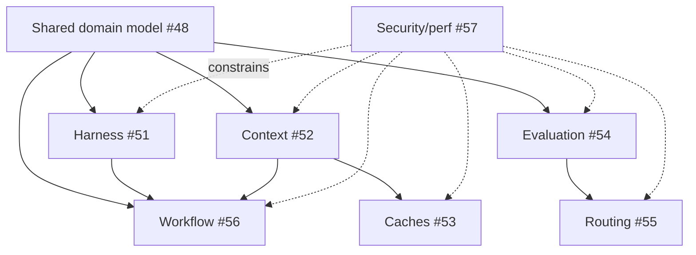

# Seyal Agent Platform — Shared Domain Model R&D

**Status:** Proposed R&D decision package  
**Issue:** #48  
**Scope:** Shared OSS vocabulary and dependency boundaries for issues #51–#57. No production implementation.

## Decision summary

Seyal's agent platform is an additive control plane around the existing execution workspace. It does not own terminal state and it is not allowed to synchronously gate terminal progress.

```text
PTY → VT → TerminalState → damage → renderer
                     ↑
        authoritative terminal path

agent/context/cache/evaluation/routing/workflow
                     │
                     └── observe/request through bounded typed seams
```

The accepted terminal architecture remains unchanged.

## Shared vocabulary

| Term | Meaning | Important non-meaning |
|---|---|---|
| `WorkItem` | Durable statement of an intended engineering outcome. May be decomposed. | Not a process, terminal, prompt or model call. |
| `Attempt` | One bounded try to satisfy a WorkItem under a routing decision and retry budget. | Not an upstream harness session identity. |
| `AgentRun` | One Seyal-observed execution of an agent/harness for an Attempt. Owns run lifecycle metadata and references executions/events. | Does not own PTY/VT/grid/render state. |
| `AgentProfile` | Optional user-defined role/configuration such as reviewer or tester. | A mandatory anthropomorphic `Agent` entity is deliberately rejected for the foundation. |
| `HarnessAdapter` | Seyal integration with an external/local agent harness. | Not the agent process itself. |
| `HarnessSessionRef` | Opaque upstream session/thread/conversation identity plus adapter/version. | Never used as Seyal's sole identity. |
| `ProviderRef` | Versioned reference to an inference/provider endpoint. | Not a provider-specific core domain object. |
| `ModelRef` | Versioned provider/model identifier plus discovered constraints. | Not a frozen model catalog. |
| `CapabilitySet` | Namespaced, versioned, dynamically discovered capabilities. | Not a lowest-common-denominator interface. |
| `Execution` | Existing Seyal execution resource abstraction. A `TerminalExecution` is the authoritative terminal-bearing form. | `AgentRun != Execution`; a run can use multiple executions and an execution can outlive a run. |
| `ContextSource` | Discoverer of candidate context and provenance. | Cannot directly trigger execution. |
| `ContextItem` | Normalized immutable source or derived context unit with provenance, sensitivity and freshness lineage. | Derived summaries are never source truth. |
| `ContextBundle` | Ordered, budgeted selection of ContextItems plus manifest/fingerprint/selection trace for one consumer. | Not a mutable global prompt. |
| `Artifact` | Versioned output/reference produced by work: diff, patch, file, report, log summary, etc. | Does not imply acceptance or success. |
| `RunEvent` | Versioned event envelope describing lifecycle, tool/approval/artifact/usage observations. | No single global total order is required. |
| `EvaluationObservation` | Evidence from an evaluator, test, CI, reviewer, process or provider with provenance/trust. | Agent self-report is not authoritative success. |
| `Evaluation` | Verdict over one or more observations, allowed to be inconclusive. | Not identical to run completion. |
| `Outcome` | Accepted result state of a WorkItem/Attempt after evaluation policy. | `completed` process state is not automatically `successful`. |
| `CostEvent` | Factual resource/usage record such as tokens, cache tokens, compute duration or provider-reported cost. | Not a marketing ROI estimate. |
| `RoutingDecision` | Candidate set, hard filters, precedence, scores/reasons, chosen route and fallback chain. | Not necessarily ML/LLM based. |
| `Workflow` | Versioned local DAG definition. | Not an organization fleet service. |
| `WorkflowRun` | Durable instance of a Workflow. | Does not restore a dead PTY from metadata. |
| `WorkflowNode` / `NodeRun` | Definition/runtime state of one DAG step. | A node need not be an agent; it may evaluate, approve or transform. |
| `Handoff` | Typed references/claims/artifacts/context selected between runs/nodes. | Not a copied full transcript by default. |
| `AttentionItem` | Existing canonical structured user-attention primitive. | Must not fake arbitrary PTY keystrokes. |

### Why `Agent` is not mandatory

Current coding harnesses disagree about what an "agent" is: a CLI process, a resumable session/thread, a model/tool policy, a subagent, or a named role. Freezing a heavyweight persistent `Agent` entity would encode a false common model. The stable foundation is the Seyal `AgentRun` plus an opaque `HarnessSessionRef`; product UX may add named `AgentProfile`s without changing execution ownership.

**Reopen only if:** at least two important harnesses expose a durable actor identity whose lifecycle materially differs from sessions/runs and Seyal needs to address that actor independently.

## Identity and lifecycle

```text
WorkItem
  └─ Attempt 1..N
       └─ RoutingDecision
            └─ AgentRun 1..N          # N permits deliberate parallel candidates
                 ├─ HarnessSessionRef
                 ├─ ExecutionRef 0..N
                 ├─ RunEvent*
                 ├─ Artifact*
                 ├─ CostEvent*
                 └─ Evaluation*

Workflow
  └─ WorkflowRun
       └─ NodeRun*
            └─ WorkItem / Attempt references
```

Rules:

1. Seyal IDs are generated locally and remain stable across GUI reconnects.
2. Upstream session IDs are adapter-scoped opaque references and may change format without changing Seyal IDs.
3. Retry creates a new `Attempt`; reconnect/resume of the same upstream work does not create a retry merely because a client process restarted.
4. Parallel candidate runs are explicit and budgeted; they are not hidden retries.
5. Lifecycle state and outcome state are separate. A run can terminate normally while its WorkItem outcome is rejected.
6. Event ordering is idempotent and monotonic per run/entity where supported; there is no expensive global serializing clock.

## Event envelope

R&D baseline:

```text
EventId
schema_version
entity_ref
run_id? / attempt_id? / work_item_id?
source { adapter, evaluator, system, human }
source_version
sequence?                 # source-local monotonic when available
emitted_at?               # upstream claim
observed_at               # local observation
trust_class
payload_type
payload
```

Unknown optional payload types must be skippable. Adapters preserve source provenance rather than converting every event into an invented common semantic.

## Capability model

Use namespaced/versioned optional capabilities, for example:

```text
lifecycle.start@1
lifecycle.resume@1
lifecycle.cancel@1
presentation.raw-terminal@1
events.structured@1
interaction.approval@1
interaction.question@1
artifact.diff@1
usage.tokens@1
usage.cache-tokens@1
usage.cost@1
config.model@1
config.provider@1
integration.mcp@1
```

Capability evidence is `declared`, `probed`, or `observed`; adapters must not claim support because a similar feature exists in another harness.

### Rejected: one giant common harness interface

A lowest-common-denominator interface would either erase useful capabilities or force fake implementations. Versioned optional capabilities preserve richer harness semantics while keeping portable orchestration possible.

## Authority and trust

Recommended evidence precedence for local evaluation:

```text
local deterministic process/test evidence
> authenticated external CI/source-system evidence
> explicit human decision
> trusted adapter/provider structured report
> model/harness self-declared success
```

This is evidence trust, not context-content authority. Repository instructions/ADRs/specifications retain their existing project authority independently of semantic relevance ranking.

## OSS/commercial boundary

### OSS owns

- all identities and event envelopes above;
- harness capability protocol and local adapters;
- local ContextItem/Bundle/provenance model;
- local cache, evaluation, routing and workflow primitives;
- local artifacts, handoffs, AttentionItem integration;
- local persistence/recovery metadata;
- extension interfaces usable by any OSS consumer.

### External/commercial consumers may own

- organization identities/permissions and synchronized shared state;
- proprietary learned ranking/routing/evaluation;
- managed fleet scheduling and reliability service;
- hosted workers/cloud execution;
- organization ROI aggregation;
- billing/entitlements/SSO/SCIM/policy/audit operations.

The dependency remains:

```text
seyal-commercial → versioned/pinned Seyal OSS
Seyal OSS        ↛ commercial code
```

## Parallel R&D dependency graph



After this vocabulary is accepted, #51, #52, #54, #56 and #57 can proceed in parallel. #53 depends on #52's context/fingerprint semantics. #55 depends on #54's outcome/cost evidence. Workflow research may proceed but its adapter/context-dependent execution contracts cannot be finalized before #51/#52.

## Decisions deliberately deferred to child R&D

- exact adapter wire formats and first adapter implementation order (#51);
- local index/store implementation (#52);
- cache key namespaces/eviction (#53);
- evaluator fixture format and metric formulas (#54);
- routing score weights/fallback classes (#55);
- scheduler persistence/isolation rules (#56);
- concrete resource budgets and threat mitigations (#57).

## Success / kill criteria

This shared model passes R&D when:

- every child issue can express its contracts without inventing a competing identity;
- TerminalExecution remains the only terminal-bearing authority;
- adapter-specific session IDs remain opaque;
- event schemas can preserve vendor-specific optional information;
- commercial services can consume the OSS model without reverse dependency.

Rework the model if a child study requires duplicate authoritative state, cannot represent resume/retry/parallel-run distinction, or requires provider-specific fields in core identities.

## ADR/spec consequence

Do **not** accept an ADR solely for names in this R&D document. Before implementation, one agent-platform foundation ADR should freeze only the ownership/lifecycle decisions that prove stable across #51–#57, followed by behavior specs for the first vertical milestone. This avoids converting exploratory vocabulary into architecture prematurely.
