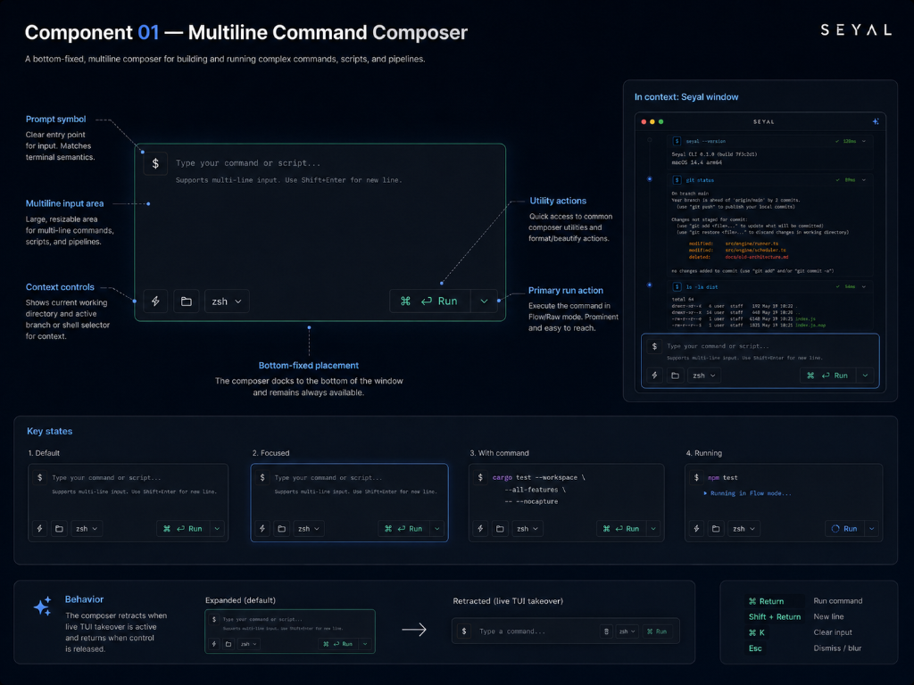
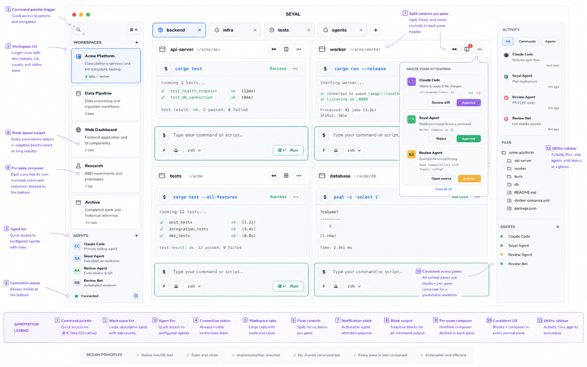
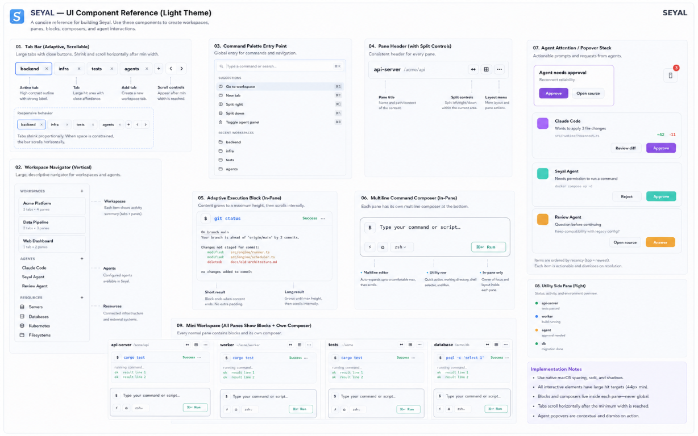

# Approved UI visual references

These images are the user-approved visual references for Seyal UI work. They are **visual authority only**: the product constitution, accepted architecture/ADRs, specifications and milestone contracts remain higher authority. Before native implementation, agents must also follow `.agents/skills/image-to-code/SKILL.md` and applicable macOS/Metal/accessibility/testing skills.

## UI-REF-001 — Multiline command composer

Visual authority for the composer geometry and controls when composer mode is eligible: multiline auto-growing editor, prompt/input area, utility row, working-directory/shell controls and Run action.

Runtime correctness still wins: unsupported/ambiguous shell states, raw interaction, secrets/password prompts, REPLs and live TUI states use direct terminal input rather than forcing the composer.

## UI-REF-002 — Light workspace composition

Broader workspace direction showing the approved relationships between larger workspace navigation, tabs, block-based terminal panes, per-pane multiline composers, pane split controls, a collapsible utility surface and the actionable agent-attention popover.

Features outside the active M001 scope remain future work; this image does not authorize implementing them early.

## UI-REF-003 — Light component reference board

Component-level visual reference for adaptive/scrollable tabs, workspace navigation, Command Palette entry, pane headers/split controls, adaptive execution Blocks, per-pane multiline composer, agent-attention stack and utility pane.

The PNG assets in this branch are the exact approved design-review references used by the native preview harness. Older WebP copies remain legacy documentation exports only.

## Approved clarifications

- There is **no common/global command composer**. Each normal terminal pane has its own composer presentation when eligibility is proven.
- Normal Flow panes present command/output as **Blocks**, not raw unstructured text panes.
- There is **no left timestamp gutter or decorative persistent execution rail** next to Blocks. Visual treatment must earn its space through user value.
- Blocks grow from result content up to the configured maximum height, then scroll internally.
- Block actions include clean **Copy command**, **Copy output**, **Copy both**, in-block search and navigation/jump to persisted Blocks. Clipboard output must not include UI borders/box-line artifacts.
- The notification popover is an **actionable agent-attention stack** (approve/reject/review/open/answer), not a generic toast stack.
- Tabs are comfortably sized, then progressively compress; once minimum width is reached the tab strip scrolls.
- Workspace rows are larger and multi-line; global navigation/search belongs in the Command Palette rather than a dedicated workspace-search field.
- Split controls belong to each pane.
- Light and dark appearances are both first-class. Shell/zsh terminal colors remain terminal content; Seyal application appearance/layout comes through typed TOML configuration (and future optional Lua only through a separately approved, non-hot-path design).
- Visual references do not authorize fake/POC UI, duplicate terminal state, a temporary renderer, a second VT/grid, or parallel old/new production paths.

If a textual design artifact conflicts with these approved visual details, reconcile the owning artifact **before implementation** rather than guessing or creating another implementation path.
