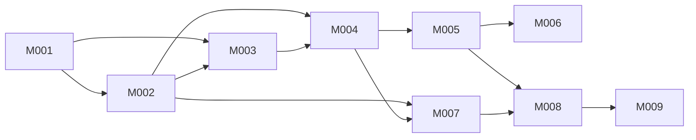

# Seyal Product Roadmap

**Status:** Authoritative execution roadmap  
**Scope:** Seyal OSS plus the public OSS seams consumed by higher editions  
**First market-ready release:** M004  
**Planning baseline:** `master` at `5594b8a37981a29819c2b87ec0cd5f9774f76d9c` on 2026-08-27

This document turns the canonical product registry into a staged execution plan. `docs/product/FEATURES.md` remains the product capability registry. ADRs/specifications remain architecture authority. This roadmap answers **when**, **under which gate**, and **through which owning issue** accepted work is allowed to advance.

## Non-negotiable architecture

The production terminal path remains Seyal-owned:

`PTY -> byte stream -> VT/parser -> TerminalState/grid -> alt-screen/Unicode/width/scrollback -> damage -> display projection -> native renderer`

On macOS the permanent renderer is AppKit + Metal. No Ghostty/libghostty production engine is permitted. Raw terminal, Blocks, semantic transcript, TUI/alternate-screen and future agent views are projections of the same `TerminalExecution`; they do not create duplicate PTYs or terminal state.

The terminal hot path must never synchronously depend on agents, cloud services, persistence, telemetry, licensing, collaboration, semantic indexing or extension code. OSS must never depend on commercial code. Higher editions consume stable OSS seams in the one-way direction documented by ADR-003.

## Release train

| Milestone | Epic | Outcome | Entry gate | Exit / release significance |
|---|---|---|---|---|
| M001 | #5 | Permanent production foundation (**Done / closed**) | Complete — Passes 1–10; #5/#727 closed on freeze `c536c54…` | Seyal-owned VT/PTY/Runtime/display/Metal foundation accepted. Contributor/nightly quality only; no market-readiness claim. Machine RSS gate **`CLIENT_RSS_KIB = 1536`**. |
| M002 | #664 | Market-parity terminal fundamentals | M001 complete | Target shells, TUIs, nested mux/SSH workloads, Unicode, scrollback/reflow, terminal search/input/mouse/link behavior and performance/resource gates are credible for technical preview. |
| M003 | #665 | Core Seyal workspace | Stable M002 terminal contracts; native seams ready | macOS windows/tabs/splits/navigation, raw/Block/composer presentation, local config/themes/fonts/keybindings and trusted shell-integration boundary form a coherent local workspace. Alpha/beta quality; still not market-ready. |
| M004 | #666 | Durable local workspace / market-ready v0.1 | M002 + M003 complete; M004 spikes resolved | Durable detach/reconnect/layout/history behavior is honest, signed/notarized/updateable macOS distribution exists, diagnostics/accessibility/docs/install/recovery/performance gates pass on one release SHA. **First serious public launch.** |
| M005 | #667 | Agent-native local substrate | M004 stable; agent R&D contracts accepted | WorkItem/Attempt/AgentRun, provider-neutral adapters, Attention, context/privacy/routing/evaluation foundations. Terminal remains independent of agent progress. |
| M006 | #668 | Automation, coding & multi-agent workflows | M005 local substrate | Command Library, safe workflow DAG, writer-isolated multi-agent work, bounded coding/SCM/DevOps surfaces and extension model. |
| M007 | #669 | Platform reach & remote continuity | M002 terminal seams stable; M004 durability assumptions explicit | Linux/Windows host work, secure SSH/remote attach, mobile/thin-client and selective sync are proven without weakening terminal ownership. |
| M008 | #670 | Collaboration platform | Stable resource addressing, remote and agent/workflow identity | Authorized exact handoff/sharing/presence/shared workflows. Public OSS contains generic seams; proprietary collaboration implementation belongs outside OSS. |
| M009 | #671 | Enterprise control plane | Collaboration/resource authority stable | Enterprise identity/RBAC/policy/audit/fleet/private-deployment capabilities build above stable OSS seams; proprietary implementation remains private. |

## Dependency graph

M003 may develop in parallel with late M002 only at stable boundaries; terminal-state/VT/Unicode/reflow changes remain owned by the terminal lane. M005 R&D can continue before M004, but production agent integration does not enter the M004 release critical path.

## Current work packages

### M002
- #672 terminal compatibility breadth and real-workload conformance.
- #673 latency/throughput/scaling gates and SY-017.
- #684 Unicode/grapheme/width/emoji/IME authority spike.
- #685 production scrollback/reflow/bounded-history spike.

### M003
- #674 native hierarchy/windows/tabs/splits/navigation.
- #675 pane input, Blocks, selection and same-execution presentation.
- #676 local config/themes/fonts/keybindings/launch policy.
- #686 trusted shell-integration/semantic-boundary spike.

### M004
- #677 market-ready macOS release, diagnostics, accessibility and release validation.
- #687 durable workspace persistence and honest recovery spike.
- #688 signing/notarization/update/rollback spike.

### M005
- #678 durable WorkItem/Attempt/AgentRun event foundation.
- #679 local agent adapters/presence/external-adapter conformance.
- #680 Attention/approvals/artifacts/exact-target UX.
- #681 Local Context Engine, privacy, evaluation and explainable routing.

### M006
- #682 Command Library, safe workflow DAG and multi-agent orchestration.
- #683 coding/SCM/DevOps/bounded developer surfaces.
- #689 terminal graphics/image strategy spike — post-M004 unless explicitly promoted.
- #690 secure out-of-process plugin model spike.

### M007
- #691 Linux PTY/native-host/GPU contract spike.
- #692 Windows ConPTY/native-host/GPU contract spike.
- #693 secure remote attach/SSH/connection-multiplexing spike.
- #694 mobile/thin-client/selective-sync spike.

### M008–M009
- #695 collaboration identity/sharing-grants/controller-authority spike.
- #696 shared workflows/presence/handoff/offline-conflict spike.
- #697 org identity/RBAC/SSO/SCIM spike.
- #698 policy/audit/secrets/compliance spike.
- #699 fleet/private-deployment/upgrade-failure-domain spike.

## First market-ready release policy

M004 is the first release allowed to claim that Seyal can be used as a serious everyday macOS terminal. A feature is not a launch blocker merely because a competitor has it. The launch bar is instead: terminal fidelity for target workloads, predictable native workspace interaction, bounded resource use, honest detach/recovery, install/update safety, accessibility/diagnostics and documentation.

Terminal graphics protocols, plugin marketplace, agent orchestration, code editor breadth, cloud collaboration, mobile, Linux and Windows are explicitly not required for M004 unless a later evidence-based decision promotes them.

See `MARKET-READY-M004.md` for the concrete launch matrix.

## Release channels

- **Nightly / contributor builds:** continuously available; no product-readiness claim.
- **Developer preview:** after M001, aimed at architecture and terminal-engine validation.
- **Technical preview / alpha:** after M002 compatibility breadth is credible.
- **Beta:** after M003 workspace behavior is coherent and stable.
- **Release candidate:** only from M004 exact-head release validation.
- **v0.1 market-ready:** only after every M004 launch blocker is green on the same release SHA.

## Three-contributor execution model

With three contributors, protect the critical path rather than maximizing simultaneous branches:

| Lane | Primary responsibility now | Parallel work allowed | Must not overlap unsafely |
|---|---|---|---|
| A — terminal/runtime | M002 VT/Unicode/reflow/compatibility (M001 Done / closed) | terminal fixtures, benchmark design | another lane changing authoritative TerminalState/VT contracts |
| B — native workspace | M003 AppKit/workspace/config once stable seams exist | UI/layout/config tests | terminal-engine duplication or speculative alternate state |
| C — quality/look-ahead | conformance, perf/CI evidence, M002–M004 spikes | docs, fixtures, release engineering | weakening exact-head/fuzz/security gates to save time |

Principal review rotates, but terminal/runtime contract changes always receive an independent reviewer.

## Scaling without false linearity

| Contributors | Sustainable execution shape | Expected gain | New bottleneck to manage |
|---|---|---|---|
| 3 | 1 critical terminal stream + 1 native stream + 1 quality/spike stream | Baseline | review and core-contract serialization |
| 5 | terminal compatibility/Unicode specialist + native/release specialist added | roughly 2 meaningful implementation fronts | integration/reviewer capacity |
| 8 | subsystem owners for terminal, native UI, durability/release, agent substrate, compatibility/quality; platform spikes can start | 3–4 meaningful fronts | cross-subsystem architecture and CI/evidence load |
| 12 | dedicated Linux/Windows/remote, agent/context, workflow/dev surfaces plus 2–3 principal reviewers | 5–6 meaningful fronts; strongest gains after M004 | product integration and release authority, not raw coding capacity |

Do not plan 5/8/12 contributors as linear multiples of three-person throughput. VT/state ownership, release integration, security review and architecture decisions remain serialized boundaries.

## Two-milestone look-ahead rule

While implementing milestone **M**, perform only decision work for **M+1** and high-risk architecture spikes for **M+2**. Do not production-implement speculative M+2 work. This keeps expensive uncertainties out of the critical path without letting designs stale before implementation.

Examples:
- During M001 (completed): resolve M002 Unicode/scrollback and M003 shell-integration; also settle M004 durability/update risks.
- During M002: M003 implementation may advance behind stable terminal seams; M004 release/durability decisions must be closed; M005 agent R&D can be promoted to implementable specs.
- During M003: M004 implementation dominates release readiness; M005 implementation packages become Ready; M006 remains R&D/spikes.

## External-contributor lanes

Good first external lanes are compatibility fixtures, shell/application reproduction cases, benchmark workloads, docs, themes, accessibility checks, isolated UI behavior and platform reconnaissance. Core VT/state/concurrency ownership, persistence failure semantics and release-security changes require maintainer-led design and review.

## Planning metadata

Roadmap milestone authority is currently the M001 milestone document plus roadmap epic issues #664–#671. The connected GitHub interface used for this planning pass can assign an existing native GitHub Milestone but cannot create new Milestone or label definitions. Native GitHub milestone/label materialization is therefore project metadata, not an unstated roadmap dependency; it must be completed through an interface that supports those mutations. The roadmap must not invent milestone numbers or pretend labels exist.

## Coverage and change control

`ROADMAP-COVERAGE.md` gives exactly one roadmap disposition for all 216 `F-*` rows, all 26 `SY-*` rows, the #197 child research issues, #640–#650, #262, M001 specifications and accepted ADR implications. New capabilities must first enter `FEATURES.md` and this coverage ledger before implementation.

A roadmap item may move milestones only when:
1. its architecture dependency has changed or new evidence invalidates the prior sequence;
2. the owning issue and coverage ledger are updated together;
3. M004 launch blockers are never silently deferred to improve a date.
